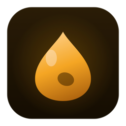

<p align="center"></p>

<h1 align="center">Ámbar</h1>

<p align="center">A clipboard history for macOS, with images and search inside them.<br>Free and open source.</p>

<p align="center"><a href="https://ambar.rrios.dev/download/ambar"><b>Download for macOS</b></a> · <a href="https://ambar.rrios.dev">ambar.rrios.dev</a></p>

---

Everything you copy — text, images, files, colours — comes back with **⌘⇧V**. Ámbar reads
the text inside every screenshot you copy, so you can find an invoice weeks later by typing
“invoice”, even though it was only ever an image.

Nothing leaves your Mac. Ámbar has no server, no account and no telemetry, and it makes no
network requests of its own.

## Features

- **History with images.** Thumbnails in the list, the full image in the preview. Binaries
  are stored on disk by content hash, not inside the database.
- **Search inside images.** Vision recognises the text of every image you copy and indexes
  it, on the device.
- **Instant search.** SQLite with FTS5; accents are optional (`cancion` finds `canción`).
- **Paste with or without formatting.** `↵` pastes every representation and lets the target
  app choose; `⌘↵` forces plain text.
- **Prefix filters.** `img:`, `file:`, `app:safari`, `pin:`.
- **Pinned items** never expire and always lead the list.
- **Voice dictation.** Hold the shortcut and speak; Ámbar shows what it hears and pastes it
  where you were. On the device, with the system's own engine. Off by default.
- **Personal dictionary.** Correct a word once while dictating and it stops failing.
- **Respects confidential data.** Items that a password manager marks as concealed are never
  stored, and you can exclude any app.
- **Keyboard first**, in 10 languages.

## Requirements

macOS 26 or later, on Apple Silicon.

## Install

Download the [latest DMG](https://ambar.rrios.dev/download/ambar), open it and drag Ámbar onto
Applications. It is signed with a Developer ID and notarized by Apple. The first time it opens,
a short walkthrough asks for the Accessibility permission, which is what lets `↵` paste into
the app you were using.

## Build from source

Xcode 26 (Swift 6.2):

```bash
swift build                      # every target
swift test                       # the whole suite
./Scripts/make-app.sh release    # the .app bundle in .build/
```

`make-app.sh` signs with a Developer ID if your keychain has one, with a local certificate
from `Scripts/setup-signing.sh` otherwise, and ad hoc as a last resort. macOS grants
Accessibility to a signature, so an ad hoc build loses the permission on every rebuild.

The release chain — preflight, notarization, stapling and the DMG — is `Scripts/release.sh`.

## Layout

```
Package.swift                one package, several targets
packages/
  BlobStore/                 binaries by content hash, plus thumbnails
  ClipboardKit/              capture, model, SQLite/FTS5, OCR
  GlassUI/                   Liquid Glass primitives and metrics
  VoiceKit/                  dictation: Speech engine, audio, capability
  AppCore/                   shortcuts, pasting, launch at login, relocation
apps/Ambar/                  the app: wiring and UI
Tests/                       the test suites
Scripts/                     bundle, DMG, signing and release
docs/                        development notes (in Spanish)
```

## License

MIT. Made by [Roberto Ríos](https://www.rrios.dev).
